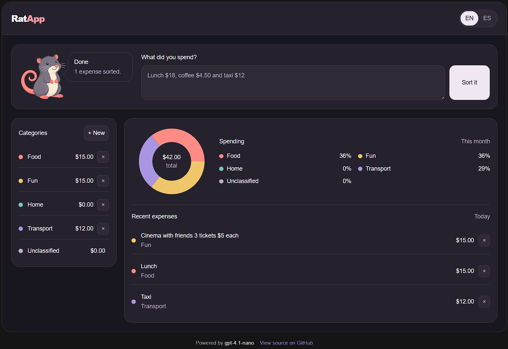

# RatApp

RatApp is a personal expense-tracking demo built with Next.js, React, and TypeScript. Users can create custom spending categories, record expenses, and view a synchronized spending summary.

It also supports natural-language expense entry powered by OpenAI: users can describe one or more expenses in English or Spanish, and Ratapp extracts and classifies them using their current category set.

Application data is stored temporarily in anonymous Redis-backed sessions, making the project suitable as a self-contained demo without user accounts or long-term personal-data storage.

[**Open the live demo →**](https://ratapp-expenses.vercel.app)



## Privacy

Expense prompts, selected language, and current category names are sent to OpenAI. OpenAI processes that input and produces the classification output. Accepted expenses remain temporarily in the anonymous Redis session. Do not submit sensitive or personally identifying information.

## Project map

- [`src/app`](src/app) — Next.js page and HTTP route entry points.
- [`src/server`](src/server) and [`src/contracts`](src/contracts) — server-only domain/persistence code and shared API wire contracts.
- [`src/features`](src/features) — category and expense UI, feature Hooks, and dashboard coordination.
- [`src/components`](src/components) — common UI and application layout components.
- [`src/i18n`](src/i18n), [`src/styles`](src/styles), and [`src/utils`](src/utils) — translations, global styles, and shared helpers.
- [`public/assets`](public/assets) — mascot images served by the application.
- [`docs`](docs) — approved mockup and design references.
- [`specs/roadmap.md`](specs/roadmap.md) — delivery status and links to phase requirements and validation evidence.

See [`src/README.md`](src/README.md) for placement and dependency rules, and [`specs/techstack.md`](specs/techstack.md) for the current architecture and planned server boundary.

## Prerequisites

- Node.js 24 or newer (active LTS)
- npm 11 or newer

## Install

```sh
npm install
```

For live classification, set the server-only `OPENAI_API_KEY` and `OPENAI_MODEL`.

## Application

Start the development server at `http://localhost:3000`:

```sh
npm run dev
```

Create and serve a production build:

```sh
npm run build
npm run start
```

## Storybook

Start Storybook at `http://localhost:6006` or create its static output:

```sh
npm run storybook
npm run build-storybook
```

Story files are colocated with components as `*.stories.tsx`. Component tests use `*.test.tsx` beside the component; shared test setup and helpers live in `src/test`.

## Quality commands

```sh
npm run format
npm run format:check
npm run lint
npm run typecheck
npm test
npm run test:redis
```

`test:redis` runs the Redis persistence and deterministic-seeder suites against an in-memory mock; tests never contact Upstash or consume its command quota. For an explicit manual test, perform a stateful action such as creating a category, inspect the resulting development-only `ratapp_session` cookie in browser developer tools, and seed it with `npm run seed:redis -- --session-id <uuid>`.

The formatting check, lint, type-check, tests, Storybook build, and Next.js build all run non-interactively and are suitable for CI.